<h1 align="center">Hi, I'm Lucas Duarte 👋</h1>

  <b>WW Principal Solutions Architect, Agentic Transformation @ AWS</b> · Kubestronaut · Speaker
   
  <i>Still automating things. Just different things.</i>

  
  
  
  

---

### About me

I started automating things in 2017 and never stopped — Ansible playbooks, Terraform modules, and Jenkins pipelines turned into a career-long obsession with eliminating toil. That evolved into container orchestration (ECS, Kubernetes), platform engineering, and go-to-market strategy for cloud customers.

Today I lead **Agentic Transformation** initiatives at AWS: designing technical workshop programs for field teams and partners, building AI-readiness assessment frameworks, and leading cross-functional teams shipping AI-native architectures at scale.

- 🔭 Working on: Agentic AI, AI-native architectures, and Kubernetes at scale
- 💬 Ask me about: Kubernetes, Amazon EKS, Agentic AI, GenAI on EKS, GitOps, SaaS, DevOps
- ⚡ Fun fact: I play music 🎸

  
  
  
  

---

### 🎤 Selected talks

- **DreamSquad Partner Meetup 2026** — [Agentic Readiness with AWS Transform](https://www.youtube.com/live/u5aDrO1-yWY)
- **KubeCon EU 2025** — From Logs to Insights: Real-time Conversational Troubleshooting for Kubernetes with GenAI
- **AWS re:Invent 2024/25** — CNS421: Streamline Amazon EKS Operations with Agentic AI
- **AWS re:Invent 2024/25** — CNS207: Accelerate Container Migrations with EKS Auto Mode
- **KubeCon NA 2024** — [Accelerating Application Delivery with OpenTofu Controller and GitOps](https://colocatedeventsna2024.sched.com/event/1jCbL/accelerating-application-delivery-with-opentofu-controller-and-gitops-lucas-duarte-tiago-reichert-aws)
- **PlatformCon 2025** — [From Chaos to Control: Structuring Repositories for Scalable GitOps on Kubernetes](https://platformcon.com/sessions/from-chaos-to-control-structuring-repositories-for-scalable-gitops-on-kubernetes)
- **Containers from the Couch** — [DeepSeek on Amazon EKS using vLLM](https://www.youtube.com/watch?v=-YeNNOZ0y84)

→ 21 talks & videos total in the [full portfolio](./PORTFOLIO.md#-conference-talks--videos)

---

### 📝 Selected writing

- [New in AWS Transform: Analyze Your Code for Modernization and Agentic Readiness](https://aws.amazon.com/blogs/migration-and-modernization/new-in-aws-transform-analyze-your-code-for-modernization-and-agentic-readiness/) · AWS Blog, 2026
- [Architecting Conversational Observability for Cloud Applications](https://aws.amazon.com/blogs/architecture/architecting-conversational-observability-for-cloud-applications/) · AWS Architecture Blog, 2025
- [Introducing AI on EKS: Powering Scalable AI Workloads](https://aws.amazon.com/blogs/containers/introducing-ai-on-eks-powering-scalable-ai-workloads-with-amazon-eks/) · AWS Blog, 2025
- [DeepSeek R1 Models Now Available on AWS](https://aws.amazon.com/blogs/aws/deepseek-r1-models-now-available-on-aws/) · AWS Blog, 2025
- [Applying Generative AI to CVE Remediation in CI Pipelines](https://aws.amazon.com/blogs/containers/applying-generative-ai-to-cve-remediation-early-vulnerability-patching-in-continuous-integration-pipelines/) · AWS Blog, 2024

→ 24 posts total in the [full portfolio](./PORTFOLIO.md#-blog-posts--articles)

---

### 📦 Featured repositories

| Repository | Stars | What it is |
|---|---|---|
| [gen-ai-on-eks](https://github.com/aws-samples/gen-ai-on-eks) |  | GenAI on EKS reference architecture using Ray |
| [deepseek-using-vllm-on-eks](https://github.com/aws-samples/deepseek-using-vllm-on-eks) |  | DeepSeek reference architecture for EKS with vLLM |
| [sample-eks-troubleshooting-rag-chatbot](https://github.com/aws-samples/sample-eks-troubleshooting-rag-chatbot) |  | Agentic EKS troubleshooting with GenAI (re:Invent CNS421) |
| [eks-saas-gitops](https://github.com/aws-samples/eks-saas-gitops) |  | Multi-tenant SaaS on EKS using GitOps (ArgoCD/Flux) |

→ 21 code samples & contributions (incl. Data on EKS, GenAI CVE Patching) in the [full portfolio](./PORTFOLIO.md#-code-samples--repositories)

---

### 🏆 Certifications

**Kubestronaut** 🥋 — the full CNCF Kubernetes stack:

**AWS** (8 active certifications):

---

### 🔗 Author & speaker profiles

[AWS Containers Blog](https://aws.amazon.com/blogs/containers/author/lucasdu/) ·
[AWS Migration & Modernization Blog](https://aws.amazon.com/blogs/migration-and-modernization/author/lucasdu/) ·
[NVIDIA Developer Blog](https://developer.nvidia.com/blog/author/lucasdu/) ·
[The New Stack](https://thenewstack.io/author/lucas-soriano-alves-duarte/) ·
[PlatformEngineering.org](https://platformengineering.org/authors/lucas-duarte) ·
[Sessionize](https://sessionize.com/lucas-duarte/)

---

### 📊 GitHub stats

  
  

Auto-generated daily by <a href="https://github.com/lowlighter/metrics">lowlighter/metrics</a> — static SVG, no flaky third-party calls.

---

<!-- AI-STATS:START -->
#### 🤖 Built in public with Claude Code

Aggregated across 1 machine(s) · 2026-05-28 → 2026-07-01 · auto-updated by `stats/`. Safe metrics only — no prompts, code, or cost. Models: claude-haiku-4-5-20251001, claude-opus-4-6, claude-opus-4-7, claude-opus-4-8.
<!-- AI-STATS:END -->
